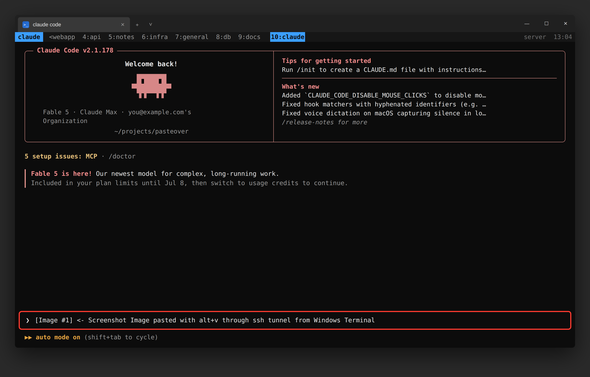

# pasteover — paste Windows screenshots into Claude Code & Codex CLI over SSH



This is a working solution for developers on Windows machines with Windows 
Terminal who ssh into remote machines and require a solution to the copy/paste 
problem. By default, Terminal/ssh won't play well together with ssh/tmux.

pasteover works with 
- Claude Code, Codex CLI, and opencode and similar
- ssh
- compatible with tailscale

The steps below say "Claude Code" throughout; only step 5 (the paste keybinding)
is tool-specific.

```
Windows                                       Linux box (runs Claude Code)
──────────────                                ────────────────────────────
clip-server.ps1                               xclip shim (~/.local/bin/xclip)
listens 127.0.0.1:18339  <──  SSH tunnel  ──  connects 127.0.0.1:18339
serves clipboard as PNG    (RemoteForward)    feeds PNG to Claude Code
```

## How it works

Claude Code on Linux reads clipboard images by shelling out to `xclip`:

```
xclip -selection clipboard -t TARGETS -o     # "is there an image?"
xclip -selection clipboard -t image/png -o   # "give me the PNG"
```

`linux/xclip` is a bash shim that answers those two calls by fetching the
image from the **Windows clipboard** through an SSH reverse tunnel, served by
`windows/clip-server.ps1`. Everything stays on loopback at both ends; the only
transport is your existing SSH connection. Full write-up (protocol, design
notes, prior art): [GUIDE.md](GUIDE.md).

---

## Setup — recommended: clone on the remote Linux box

You SSH into this machine anyway, so start there. Git on Windows not required.

### 1. Remote (Linux): clone and install the shim

```bash
git clone https://github.com/davidszp/pasteover ~/pasteover
mkdir -p ~/.local/bin
cp ~/pasteover/linux/xclip ~/.local/bin/xclip
chmod +x ~/.local/bin/xclip
```

Check that `~/.local/bin` wins the PATH race (prints the shim's path, and
warns you if a real xclip is installed — see Troubleshooting if so):

```bash
which xclip   # must print: /home/you/.local/bin/xclip
```

### 2. Windows: pull the server script from the remote

In PowerShell on the Windows host (you already have SSH access — reuse it):

```powershell
scp you@your-server:pasteover/windows/clip-server.ps1 $HOME\clip-server.ps1
```

(No scp? The script is one file — open `windows/clip-server.ps1` on the remote
and copy-paste it into Notepad, save as `clip-server.ps1` in your home folder.)

### 3. Windows: add the SSH tunnel

Edit `%USERPROFILE%\.ssh\config` (`notepad $HOME\.ssh\config`; create it if
missing, and make sure it isn't saved as `config.txt`). Add `RemoteForward`
to the host entry you use:

```
Host your-server
    HostName your-server.example.com
    User you
    RemoteForward 18339 127.0.0.1:18339
```

One-off alternative, no config file: `ssh -R 18339:127.0.0.1:18339 you@your-server`.

### 4. Windows: start the clipboard server

```powershell
powershell.exe -STA -ExecutionPolicy Bypass -File $HOME\clip-server.ps1
```

Leave that window open, or register it to auto-start hidden at every logon
(one line — the `-User` scoping is required, or you get `Access is denied`):

```powershell
Register-ScheduledTask -TaskName 'pasteover' -Action (New-ScheduledTaskAction -Execute 'powershell.exe' -Argument "-STA -WindowStyle Hidden -ExecutionPolicy Bypass -File $HOME\clip-server.ps1") -Trigger (New-ScheduledTaskTrigger -AtLogOn -User "$env:USERDOMAIN\$env:USERNAME")
```

### 5. The paste key (Windows Terminal users: don't skip this)

**Windows Terminal swallows Ctrl+V** for its own text-paste, so the keypress
never reaches Claude Code — paste will silently do nothing. Fix: give Claude
Code a second paste key. On the **remote**, the repo ships the config:

```bash
cp ~/pasteover/claude/keybindings.json ~/.claude/keybindings.json
# (or merge the "alt+v" binding into your existing file)
```

Restart Claude Code. **Alt+V** now pastes images. (Alternative: unbind
`ctrl+v` in Windows Terminal's settings — you keep Ctrl+Shift+V for text.)

### 6. Use it

Reconnect SSH (the tunnel only exists on sessions started after step 3), take
a screenshot with `Win+Shift+S`, press **Alt+V** in Claude Code →
`[Image #1]`.

---

## Bonus: large text pastes (Alt+Shift+V)

Terminals, SSH, and multiplexers (tmux and friends) **truncate very large
pastes** before the app ever sees them — paste 60 KB of text into Claude Code
over SSH and it arrives cut short. Claude Code itself doesn't truncate (it
collapses big pastes to a `[Pasted text #N]` placeholder and sends the full
content on submit); the loss happens at the terminal/PTY layer.

pasteover sidesteps it the same way it does images — over the SSH tunnel
instead of the paste path. `clip-server.ps1` also serves clipboard **text**
(`CHECKTEXT`/`GETTEXT`), and the `linux/bigpaste` helper pulls it into a file
the agent reads, so there's no size limit.

**Install the helper (remote/Linux):**

```bash
cp ~/pasteover/linux/bigpaste ~/.local/bin/bigpaste
chmod +x ~/.local/bin/bigpaste
```

**Add a Windows Terminal keybinding** — in Settings → Open JSON file, add to
the `actions` (or `keybindings`) array a key that types `!bigpaste` + Enter
into the focused pane:

```json
{ "keys": "alt+shift+v", "command": { "action": "sendInput", "input": "!bigpaste\r" } }
```

**Use it:** copy text on Windows, focus Claude Code on an **empty** prompt,
press **Alt+Shift+V**. That runs `bigpaste` via Claude Code's `!` shell prefix;
it saves the clipboard text to `/tmp/pasteover/paste-<timestamp>.txt` and prints
the path into the conversation, which Claude then reads. (Alt+V still handles
images; Alt+Shift+V handles text — the two are independent.)

You can also just type `!bigpaste` yourself if you'd rather not add the
keybinding. The helper reuses the same tunnel, so no extra setup beyond the
text-capable `clip-server.ps1`.

---

## Universal paste — one key (Alt+V) for everything (smartpaste)

`windows/smartpaste.py` makes **Alt+V paste whatever is on the clipboard** — no
second key to remember:

| Clipboard holds | smartpaste does |
|---|---|
| a **file** (PDF, doc, code, …) | `scp`s it to `~/pasteover-inbox/` on the remote, then types an `@/home/you/pasteover-inbox/<name>` mention into the terminal — the agent reads it |
| an **image** / screenshot | hands Alt+V back to the agent's own image paste (the proven xclip-shim path — **unchanged**) |
| **small text** (≤ 4000 chars) | fires **Ctrl+V** (inline terminal paste) |
| **large text** (> 4000 chars) | runs `!bigpaste` (over the tunnel, no PTY truncation) |

**How one key does it all:** a global hook owns Alt+V and suppresses it, so it
reaches this script *before* the agent. For images — and whenever the focused
window isn't your terminal — the hook briefly unhooks itself, re-emits a real
Alt+V, and re-arms, so Alt+V behaves exactly as before there. **No
keybindings.json change** — `alt+v → chat:imagePaste` stays as-is, and the base
image/text setup above is untouched. Files are *pushed* over the same
passwordless key-auth SSH the tunnel already uses (Host alias `builds`) — no new
auth, nothing new listens on the remote.

The old **Alt+Shift+V** `!bigpaste` Terminal keybinding is now redundant (Alt+V
handles large text too); keep or remove it — smartpaste still calls the
`linux/bigpaste` helper, so leave that installed.

**Install (Windows):**

```powershell
pip install keyboard pywin32          # deps (run once)
```

On the **remote**, make the inbox dir (files land here):

```bash
mkdir -p ~/pasteover-inbox
```

**Run it (hidden, at logon)** alongside `clip-server.ps1` / `tunnel.ps1` — use
`pythonw.exe` so there's no console window:

```powershell
pythonw.exe $HOME\pasteover\windows\smartpaste.py
```

Register it the same way as the tunnel (Task Scheduler → At log on → run
`pythonw.exe` with the script path, hidden). To test in the foreground first,
run it with plain `python.exe` and watch the log lines.

**Use it:** copy a file / image / text on Windows, focus the agent on an
**empty** prompt, press **Alt+V**. For files the `@path` is typed in ready to
send; review, then Enter. (`keyboard` needs the hook installed at the OS level —
if Alt+V does nothing, run the terminal, or smartpaste, **as administrator**.)

**Tunables** (env vars, all optional): `SMARTPASTE_HOTKEY`,
`SMARTPASTE_SSH_HOST`, `SMARTPASTE_INBOX`, `SMARTPASTE_PREFIX` (`@` → `` for a
bare path), `SMARTPASTE_TEXT_INLINE_MAX`, `SMARTPASTE_MAX_BYTES`,
`SMARTPASTE_TERMINALS` (comma list of terminal exe names to act in; empty =
always act).

**Inbox housekeeping** — files accumulate in `~/pasteover-inbox/`. Prune old
ones with a cron entry on the remote, e.g. daily:

```bash
find ~/pasteover-inbox -type f -mtime +7 -delete
```

**Works for any agent CLI** (Codex, opencode, …): images/text are agent-agnostic
already, and a file is just a path the agent can open — set `SMARTPASTE_IMAGE_KEY`
if the agent binds image paste to something other than Alt+V.

---

## Keeping the tunnel always up (optional but recommended)

The `RemoteForward` only lives as long as the SSH session that carries it, so if
you open and close interactive sessions the bridge dies half the time. Note the
tunnel is a *reverse* forward **initiated by the Windows host** — the remote box
is the SSH server and can't create it, so any keepalive must run on Windows (a
scheduled task is the Windows equivalent of a systemd unit).

`windows/tunnel.ps1` holds a dedicated, auto-reconnecting SSH connection open in
the background so the tunnel is up whenever the laptop is:

```powershell
# 1. requires non-interactive (key-auth, no passphrase prompt) SSH to the remote:
ssh -o BatchMode=yes your-server "echo ok"
# 2. remove `RemoteForward 18339 127.0.0.1:18339` from your Host block in
#    ~/.ssh/config so interactive sessions don't fight this dedicated tunnel.
# 3. register it hidden at logon:
Register-ScheduledTask -TaskName 'pasteover-tunnel' -Action (New-ScheduledTaskAction -Execute 'powershell.exe' -Argument "-WindowStyle Hidden -ExecutionPolicy Bypass -File $HOME\tunnel.ps1") -Trigger (New-ScheduledTaskTrigger -AtLogOn -User "$env:USERDOMAIN\$env:USERNAME")
Start-ScheduledTask -TaskName 'pasteover-tunnel'
```

Edit `$remote` at the top of `tunnel.ps1` to match your SSH host alias.

## Troubleshooting

Work down the chain from the Linux side:

```bash
# 1. Tunnel up?
ss -tln | grep 18339          # nothing -> reconnect SSH (RemoteForward missing)

# 2. Windows server answering?
exec 3<>/dev/tcp/127.0.0.1/18339 && printf 'CHECK\n' >&3 && head -c 8 <&3; exec 3<&- 3>&-
# "PNG"  -> bridge works, image on clipboard
# "NONE" -> bridge works, clipboard holds text/nothing
# error  -> tunnel up but clip-server.ps1 not running on Windows

# 3. Shim behaving? (exactly what Claude Code runs)
xclip -selection clipboard -t TARGETS -o                        # -> image/png
xclip -selection clipboard -t image/png -o > /tmp/t.png && file /tmp/t.png
```

- **Bridge answers `PNG` but the paste key does nothing:** you're in the
  Windows Terminal Ctrl+V trap — see step 5. (Tell-tale: pasting into Paint
  works, the terminal doesn't.)
- **A real xclip is already installed** (desktop Linux): the shim shadows it
  for everything, and non-image xclip calls will silently fail. Edit the
  shim's last line from `exit 1` to `exec /usr/bin/xclip "$@"` to pass
  everything else through.
- **`Warning: remote port forwarding failed` on a second SSH session:**
  harmless — the first session holds the tunnel and keeps serving. Paste
  breaks only when *that* session closes; reconnect any session to rebind.
- **Different port:** change `$port` in clip-server.ps1 and the RemoteForward
  line; the shim reads `CLIP_BRIDGE_PORT`.

## Security

Both listeners bind loopback only; the image crosses machines exclusively
inside the SSH channel. Scope: anyone who can reach `127.0.0.1:18339` on the
*Linux box* while your tunnel is up can read images (only images) from your
Windows clipboard — fine on a single-user box, think twice on a shared one.

---

## Alternative setup: clone on the Windows host

If you'd rather keep the repo on Windows and push files *up* to the remote:

```powershell
# 1. Clone on Windows
git clone https://github.com/davidszp/pasteover $HOME\pasteover

# 2. Server runs straight from the repo
powershell.exe -STA -ExecutionPolicy Bypass -File $HOME\pasteover\windows\clip-server.ps1

# 3. Upload the shim and keybindings to the remote
ssh you@your-server "mkdir -p .local/bin .claude"
scp $HOME\pasteover\linux\xclip you@your-server:.local/bin/xclip
scp $HOME\pasteover\claude\keybindings.json you@your-server:.claude/keybindings.json
ssh you@your-server "chmod +x .local/bin/xclip"
```

Then continue with steps 3–6 above (SSH tunnel, scheduled task, paste key).
Careful with the scp of `keybindings.json` if the remote already has one —
merge instead of overwriting.

## Files

| File | Goes to | Machine |
|---|---|---|
| `linux/xclip` | `~/.local/bin/xclip` (`chmod +x`) | remote (Linux) |
| `linux/bigpaste` | `~/.local/bin/bigpaste` (`chmod +x`) — large-text paste | remote (Linux) |
| `windows/clip-server.ps1` | anywhere, e.g. `$HOME` | host (Windows) |
| `windows/tunnel.ps1` | anywhere, e.g. `$HOME` — keeps the tunnel always up | host (Windows) |
| `windows/smartpaste.py` | anywhere, e.g. `$HOME\pasteover\windows` — universal one-key paste (files/images/text) | host (Windows) |
| `claude/keybindings.json` | `~/.claude/keybindings.json` | remote (Linux) |

## Prior art

[clipaste](https://github.com/hqhq1025/clipaste) (SSH mode macOS-only),
[cc-clip](https://github.com/ShunmeiCho/cc-clip) (Windows path experimental),
[clipssh](https://github.com/samuellawrentz/clipssh) (pastes a file path, not
a keypress), [claude-ssh-image-skill](https://github.com/AlexZeitler/claude-ssh-image-skill)
(no Windows client). Native support is tracked in
[anthropics/claude-code#42712](https://github.com/anthropics/claude-code/issues/42712).
See [GUIDE.md](GUIDE.md) for the full comparison and design write-up.
